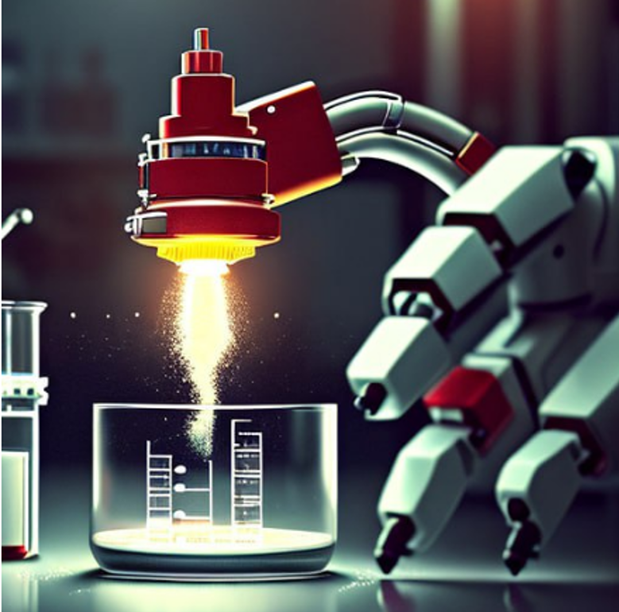
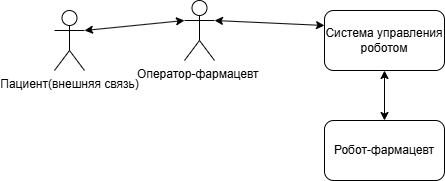
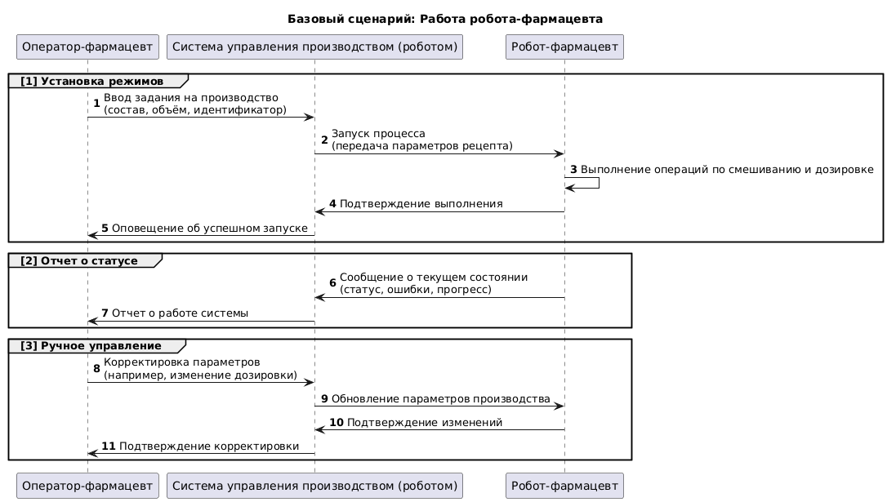
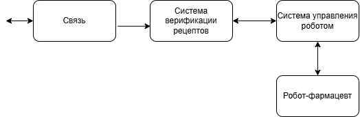
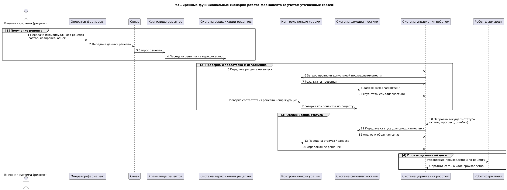
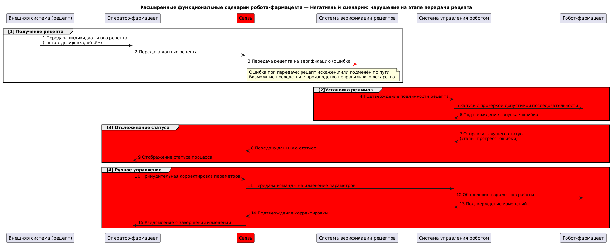
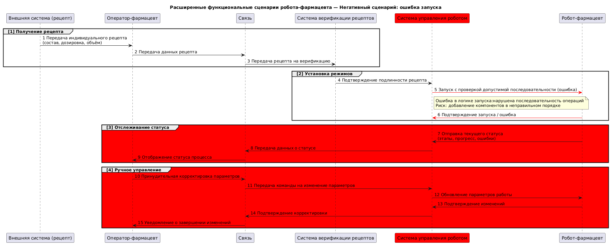
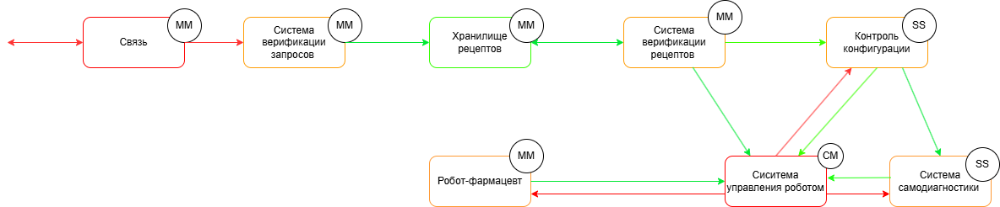
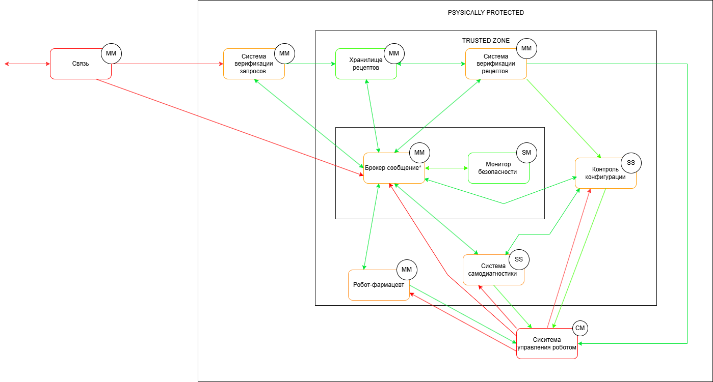

# Робот-фармацевт

## Краткое описание проектируемой системы

Продукт - робот-фармацевт, который производит лекарство по индивидуальному рецепту.
Рецепт включает в себя:
a) точный состав и количество компонентов, порядок и условия изготовления конечного продукта;
б) уникальный идентификатор лекарства, который изготавливается в определённом объёме для индивидуального
курса лечения валифицированным персоналом без необходимости изменения системного ПО.

## Ключевые ценности, ущербы, неприемлемые события

| Ценность | Нежелательные события | Величина ущерба | Комментарий |
|----------|-----------------------|-|------------|
| Лекарство | Нарушение технологического процесса | Высокий | Возможно причинение вреда здоровью клиента  | 
| Рецептура | Неавторизованный доступ к рецептуре (раскрытие торгового секрета) | Высокий | Конкуренты смогут производить аналоги. PR риски из-за публикации рецептуры (критично для дорогостоящего БАДов и прочей гомеопатии) |
| Персональные данные | Неавторизованный доступ к персональным данных клиентов | Высокий | Оборотный штраф для организации| 
Робот | Невозможность производства лекарства из-за отказа оборудования | Средний | При необходимости сотруник фармацевт сможет вручную приготовить небольшие партии лекарства| 
| Люди | Отправление из-за приёма неправильного лекарства | Высокий | Возможно причинение вреда здоровью клиента |

## Роли пользователей

| Роль | Назначение |
|----------|-----------------------|
| Оператор-фармацевт | Вводит задание на производство и получает лекарство дл передачи клиенту | 
| Пациент | Получает рецепт от врача в клинике и по этому рецепту получает лекарство в аптеке |

## Контекст

## Основные функциональные сценарии

## Высокоуровневая архитектура

## Описание подсистем
| Название | Назначение |
|----------|-----------------------|
| Связь  | 	Обеспечивает передачу данных между подсистемами.| 
| Система управления роботом| Контролирует процесс производства: отправляет команды роботу, получает и анализирует его состояние, обеспечивает выполнение технологической последовательности.|
| Робот-фармацевт  | 	Выполняет операции по смешиванию, дозировке и упаковке лекарственных средств.| 
| Система верификации рецептов| 	Проверяет подлинность и корректность полученного рецепта, включая состав, дозировку и уникальные идентификаторы, а также подтверждает, что рецепт выдан авторизованным источником и соответствует установленным медицинским стандартам и регламентам.
|

## Расширенные диаграммы функциональных сценариев

## Цели и предположения безопасности

#### Цели безопасности
1. Состав приготовленного лекарства всегда соотвествует параметрам, указанным оператором.

2. Только авторизованные роли имеют доступ к рецептурной информации и персональным данным клиентов.

3. Роботизированный комплекс принимает команды только при подтверждённом штатном состоянии.

4. Критические неисправности автоматически блокируют выполнение команд.

5. Клиент получает лекарство только при подтверждённом соответствии состава, срока годности и условии хранения.

####  Предположения безопасности
1. Физическая защита: Физический доступ к роботу, его сенсорам, исполнительным устройствам и портам исключен.

2. Контроль доступа: Только аутентифицированные и авторизованные пользователи имеют доступ к интерфейсу управления роботом и к его программной конфигурации.

3. Благонадежность пользователей: Авторизованные пользователи благонадёжны и не стремятся нарушить работоспособность системы и компрометировать данные.

4. Изолированность среды исполнения: Программное обеспечение робота исполняется в среде, защищённой от внедрения постороннего кода.

5. Сетевая безопасность обеспечена извне: Внешние коммуникационные каналы защищены от сетевых атак.

## Таблица соотнесения ценностей, неприемлемых событий и целей безопасности
| Ценность | Негативное событие | Оценка ущерба | Цель безопасности |
|----------|-----------------------|-|--------|
| Лекарство | Нарушение технологического процесса | Высокий | 1 | 
| Рецептура | Неавторизованный доступ к рецептуре (раскрытие торгового секрета) | Высокий |2|
| Персональные данные | Неавторизованный доступ к персональным данных клиентов | Высокий |2| 
Робот | Невозможность производства лекарства из-за отказа оборудования | Средний | 3, 4| 
| Люди | Отправление из-за приёма неправильного лекарства | Высокий | 5 |

## Негативные сценарии

 ## Политика архитектуры 
 #### Версия 1
 

 ## Описание подсистем 
| Название | Назначение |
|----------|-----------------------|
| Связь  | Обеспечивает передачу данных между подсистемами. |
| Система верификации запросов | Проверяет корректность входящих запросов на наличие необходимых параметров, целостность и допустимость к выполнению. Является первой линией защиты от некорректных или вредоносных данных. |
| Хранилище рецептов | Сохраняет индивидуальные рецепты, полученные от внешней системы, для последующей проверки и исполнения. |
| Система верификации рецептов | Проверяет подлинность и корректность полученного рецепта, включая состав, дозировку и уникальные идентификаторы, а также подтверждает, что рецепт выдан авторизованным источником и соответствует установленным медицинским стандартам и регламентам. |
| Контроль конфигурации | Проверяет допустимость выполнения рецепта в текущем техническом и программном состоянии системы, а также хранит допустимые конфигурации и последовательности операций. |
| Система самодиагностики | Выполняет внутреннюю диагностику состояния компонентов системы, включая роботизированные модули, для обнаружения неисправностей и оценки готовности к выполнению задач. |
| Система управления роботом | Контролирует процесс производства: отправляет команды роботу, получает и анализирует его состояние, обеспечивает выполнение технологической последовательности. |
| Робот-фармацевт | Выполняет операции по смешиванию, дозировке и упаковке лекарственных средств в соответствии с полученными командами и рецептом. | 

| Домен безопасности | Уровень доверия | Оценка сложности и размера домена | Обоснование |
|----------|-----------------------|-|--------|
| Связь | Недоверенный| MM| Коммуникационный стек передаёт рецентурные параметры и команды. Подмена сообщений напрямую ведёт к изготовлению препарата с неверным составом (цель 1) и раскрытию ПД (цель 2), поэтому его компрометация недопустима.|
| Система верификации запросов | Доверенный, повышающий целостность данных | MM | Компрометация не нарушает ЦБ, так как некорректные или вредоносные запросы не могут повлиять на дальнейшее выполнение рецепта без прохождения последующей верификации и проверки конфигурации (ЦБ1, ЦБ3, ЦБ5 остаются защищёнными)|
| Хранилище рецептов | Доверенный| MM| Рецепты подписаны ЭЦП, а робот готовит лекарство только по подтверждённому подписью рецепту. При компрометации невалидная подпись блокирует использование → цели 1, 4 не нарушаются.| 
| Система управления роботом| Недоверенный| CM |	Управляет всей роботизированной логикой. При компрометации возможна подмена команд, но система конфигурации минимизирует риски.|
| Робот-фармацевт | Недоверенный | MM |Критические отклонения исполнительных механизмов обнаруживаются оптическим контролем массы/объёма перед выдачей. При несоответствии препарат блокируется, поэтому цели 1, 4 не нарушаются.| 
Система верификации рецептов| Доверенный, повышающий целостность данных | MM |Обеспечивает достоверность входных рецептов. Компрометация приводит к искажению исходных данных, что делает невозможным выполнение ЦБ1 (соответствие состава рецептуре) и ЦБ5 (выдача проверенного лекарства). Поэтому система защищена механизмами контроля подлинности и отклоняет модифицированные рецепты.| 
Контроль конфигурации| Доверенный, повышающий целостность данных| SS |	Гарантирует соответствие состава и технологических параметров заданным требованиям. При компрометации нарушаются ЦБ1 (несоответствие состава), ЦБ3 (возможность выполнения команд в нештатном состоянии) и ЦБ4 (невозможность блокировки в случае неисправности), так как отклонения не будут выявлены. Поэтому домен считается доверенным и его защита критична.|
Система самодиагностики| Доверенный| SS |	Обеспечивает достоверную информацию о состоянии оборудования. При компрометации возможна передача ложных сведений о штатном режиме, что приведёт к выполнению команд в нештатном состоянии и невозможности блокировки при неисправности. Нарушаются ЦБ3 (приём команд вне штатного состояния) и ЦБ4 (невыполнение блокировки при критической ошибке). Поэтому система считается доверенной и должна быть защищена от компрометации.|

 #### Версия 2 
 
 ##### Описание подсистем 
| Название | Назначение |
|----------|-----------------------|
| Связь  | Обеспечивает передачу данных между подсистемами. |
| Система верификации запросов | Проверяет корректность входящих запросов на наличие необходимых параметров, целостность и допустимость к выполнению. Является первой линией защиты от некорректных или вредоносных данных. |
| Хранилище рецептов | Сохраняет индивидуальные рецепты, полученные от внешней системы, для последующей проверки и исполнения. |
| Система верификации рецептов | Проверяет подлинность и корректность полученного рецепта, включая состав, дозировку и уникальные идентификаторы, а также подтверждает, что рецепт выдан авторизованным источником и соответствует установленным медицинским стандартам и регламентам. |
| Контроль конфигурации | Проверяет допустимость выполнения рецепта в текущем техническом и программном состоянии системы, а также хранит допустимые конфигурации и последовательности операций. |
| Система самодиагностики | Выполняет внутреннюю диагностику состояния компонентов системы, включая роботизированные модули, для обнаружения неисправностей и оценки готовности к выполнению задач. |
| Система управления роботом | Контролирует процесс производства: отправляет команды роботу, получает и анализирует его состояние, обеспечивает выполнение технологической последовательности. |
| Робот-фармацевт | Выполняет операции по смешиванию, дозировке и упаковке лекарственных средств в соответствии с полученными командами и рецептом. |
| Брокер сообщений | Централизованный компонент для маршрутизации сообщений между подсистемами. Обеспечивает надежную доставку и координацию взаимодействия компонентов. |
| Монитор безопасности | Анализирует потоки данных и событий в системе на предмет нарушений политики безопасности, фиксирует инциденты и аномалии. |

| Домен безопасности | Уровень доверия | Оценка сложности и размера домена | Обоснование |
|----------|-----------------------|-|--------|
| Связь | Недоверенный| MM| Находится вне доверенной зоны. Возможна подмена или искажение данных извне. Угрозы смягчаются системой верификации и контролем конфигурации.|
| Система верификации запросов | Доверенный, повышающий целостность данных | MM | Принимает и анализирует входящие запросы. Даже при компрометации не нарушает безопасность, так как рецепты проверяются отдельно. Фильтрует заведомо недопустимые запросы, снижая риски на раннем этапе. |
| Хранилище рецептов | Доверенный| MM|Уязвим для атак, так как получает данные извне. Может содержать поддельные или искажённые рецепты. Надёжность обеспечивается дальнейшей проверкой.| 
| Система управления роботом| Недоверенный |CM |	Подвержена атаке через команды от брокера. Проверяется системой конфигурации. При сбое может нарушить работу производственного процесса.|
| Робот-фармацевт | Недоверенный | MM |	Выполняет производство. Уязвим к недостоверным управляющим командам. Компрометация влияет на физический результат.| 
| Система верификации рецептов| Доверенный, повышающий целостность данных | MM |Работает в доверенной зоне. Проверяет рецепты на корректность и подлинность, фильтрует недостоверные данные.| 
Контроль конфигурации| Доверенный, повышающий целостность данных| SS |Критическая подсистема, гарантирующая соответствие производственного процесса утверждённым параметрам. При её компрометации нарушается вся модель доверия.|
Брокер сообщений| Доверенный, повышающий целостность данных| MM |Центр маршрутизации сообщений, получает данные как от доверенных, так и недоверенных компонентов. Риски снижены за счёт мониторинга и верификации.|
Монитор безопасности| Доверенный| SM |Отвечает за контроль работы подсистем, регистрирует нарушения. Вмешательство в него может скрыть атаки.|
Система самодиагностики| Доверенный| SS |	Обеспечивает контроль технического состояния. Подмена информации в ней может привести к эксплуатации неисправных узлов|

#### Политика безопасности взаимодействий
    import base64

    VERIFIER_SEAL = 'verifier_seal' # строка-подпись, используется как простой маркер целостности и доверия

    def check_payload_seal(payload): # функция убедиться, что данные не были изменены и были подписаны надёжным источником
        try:
            p = base64.b64decode(payload).decode()
            if p.endswith(VERIFIER_SEAL):
                print('[info] payload seal is valid')
                return True
        except Exception as e:
            print(f'[error] seal check error: {e}')
        return False

    def check_operation(id, details):
        authorized = False
        print(f"[info] checking policies for event {id}, {details['source']}->{details['deliver_to']}: {details['operation']}")

        src = details['source']
        dst = details['deliver_to']
        operation = details['operation']

        # Связь -> Брокер (начало запроса)
        if src == 'connection' and dst == 'broker' and operation == 'request_recipe':
            authorized = True

        # Брокер -> Хранилище рецептов 
        if src == 'broker' and dst == 'recipe_storage' and operation == 'get_recipe':
            authorized = True

        # Хранилище рецептов -> Брокер 
        if src == 'recipe_storage' and dst == 'broker' and operation == 'recipe_found':
            authorized = True

        # Брокер -> Система верификации рецептов 
        if src == 'broker' and dst == 'recipe_verifier' and operation == 'verify_recipe':
            authorized = True

        # Система верификации рецептов <-> Хранилище рецептов 
        if src == 'recipe_verifier' and dst == 'recipe_storage' and operation == 'get_recipe_data':
            authorized = True
        if src == 'recipe_storage' and dst == 'recipe_verifier' and operation == 'recipe_data':
            authorized = True

        # Система верификации -> Контроль конфигурации 
        if src == 'recipe_verifier' and dst == 'config_control' and operation == 'recipe_verified':
            authorized = True

        # Брокер -> Контроль конфигурации 
        if src == 'broker' and dst == 'config_control' and operation == 'control_request':
            authorized = True

        # Контроль конфигурации <-> Система управления роботом 
        if src == 'config_control' and dst == 'robot_control' and operation == 'apply_recipe':
            authorized = True
        if src == 'robot_control' and dst == 'config_control' and operation == 'report_state':
            authorized = True

        # Система управления роботом -> Брокер 
        if src == 'robot_control' and dst == 'broker' and operation == 'status_report':
            authorized = True

        #  Система управления роботом -> Система самодиагностики 
        if src == 'robot_control' and dst == 'self_diagnosis' and operation == 'request_diagnostics':
            authorized = True

        #  Система самодиагностики -> Брокер 
        if src == 'self_diagnosis' and dst == 'broker' and operation == 'diagnostic_result':
            authorized = True

        # Брокер -> Монитор безопасности 
        if src == 'broker' and dst == 'security_monitor' and operation == 'log_event':
            authorized = True

        #  Монитор безопасности -> Брокер 
        if src == 'security_monitor' and dst == 'broker' and operation == 'alert':
            authorized = True

        # Верифицированная передача рецепта в управление роботом 
        if src == 'broker' and dst == 'robot_control' and operation == 'apply_verified_recipe':
            if details.get('verified') and check_payload_seal(details.get('blob', '')):
                authorized = True

        # Робот-фармацевт -> Брокер
        if src == 'pharma_robot' and dst == 'broker' and operation == 'ready_product':
            authorized = True

        # Брокер -> Связь (выдача готового лекарства пользователю)
        if src == 'broker' and dst == 'connection' and operation == 'deliver_product':
            if details.get('verified') and check_payload_seal(details.get('product_blob', '')):
                authorized = True

        return authorized
