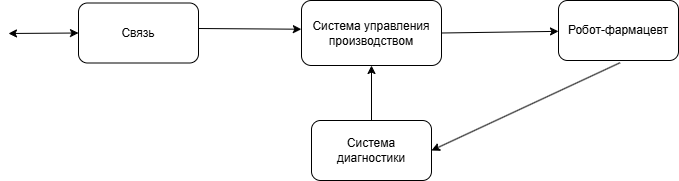
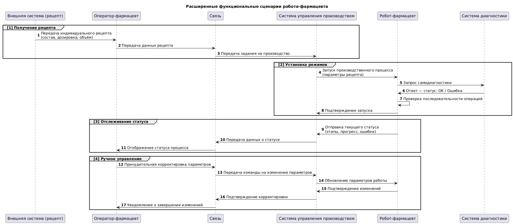
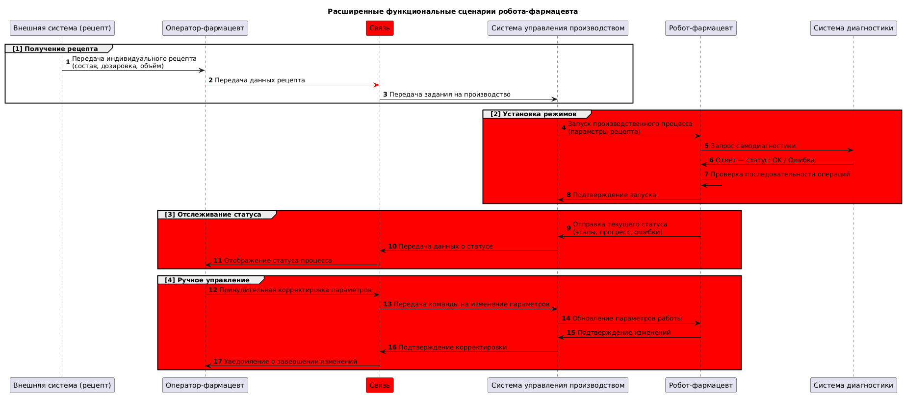
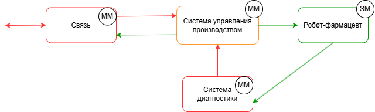
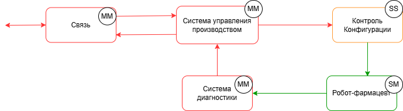

# Робот-фармацевт

## Краткое описание проектируемой системы

Продукт - робот-фармацевт, который производит лекарство по индивидуальному рецепту.
Рецепт включает в себя:
a) точный состав и количество компонентов, порядок и условия изготовления конечного продукта;
б) уникальный идентификатор лекарства, который изготавливается в определённом объёме для индивидуального
курса лечениявалифицированным персоналом без необходимости изменения системного ПО.

## Ключевые ценности, ущербы, неприемлемые события

| Ценность | Нежелательные события | Величина ущерба | Комментарий |
|----------|-----------------------|-|------------|
| Лекарство | Нарушение технологичского процесса | Высокий | Возможно причинение вреда здоровью клиента  | 
| Рецептура | Неавторизованный доступ к рецептуре (раскрытие торгового секрета) | Выскокий | Конкуренты смогут производить аналоги. PR риски из-за публикации рецептуры (критично для дорогостоящего БАДов и прочей геопатии) |
| Персональные данные | Неавторизованный доступ к персональным данных клиентов | Высокий | Оборотный штраф для организации| 
Робот | Невозможность производства лекарства из-за отказа оборудования | Средний | При необходимости сотруник фармацевт сможет вручную приготовить небольшие партии лекарства| 
| Люди | Отправление из-за приёма неправильного лекарства | Высокий | Возможно причинение вреда здоровью клиента |

## Роли пользователей

| Роль | Назначение |
|----------|-----------------------|
| Оператор-фармацевт | Вводит задание на производство и получает лекарство дл передачи клиенту | 
| Пациент | Получает рецепт от врача в клинике и по этому рецепту получает лекарство в аптеке |

## Контекст

## Основные функциональные сценарии

## Высокоуровневая архитектура

## Описание подсистем
| Название | Назначение |
|----------|-----------------------|
| Связь  | 	Обеспечивает передачу данных между подсистемами.| 
| Система управления производством | Контролирует процесс производства, отправляет команды роботу и анализирует его состояние. |
| Робот-фармацевт  | 	Выполняет операции по смешиванию, дозировке и упаковке лекарственных средств.| 
| Система диагностики| 	Проверяет корректность выполнения операций, диагностирует ошибки и сообщает о них системе управления. |

## Расширенные диаграммы функциональных сценариев

## Цели и предположения безопасности

#### Цели безопасности
1. Гарантия точности производства – лекарственные средства должны изготавливаться строго в соответствии с заданными параметрами, без отклонений.

2. Конфиденциальность данных – рецептурная информация и персональные данные клиентов должны оставаться недоступными для неавторизованных лиц.

3. Функциональная надежность – робот-фармацевт должен быть устойчив к отказам и обеспечивать контроль своего технического состояния.

4. Безопасность для пациентов – исключение ситуаций, при которых клиент получает неверное или некачественное лекарство.

#### Предположения безопасности
1. Физическая защита: Робот-фармацевт и его система управления находятся в контролируемом помещении с ограниченным доступом.

2. Защита информации: Доступ к рецептуре и персональным данным клиентов предоставляется только авторизованным пользователям.

3. Устойчивость к сбоям: Робот оснащен системой самодиагностики, которая позволяет своевременно выявлять и предотвращать критические отказы.

4. Контроль качества: Перед выдачей лекарства выполняется проверка соответствия состава рецептурным требованиям.

## Таблица соотнесения ценностей, неприемлемых событий и целей безопасности
| Ценность | Негативное событие | Оценка ущерба | Цель безопасности |
|----------|-----------------------|-|--------|
| Лекарство | Нарушение технологичского процесса | Высокий | 1 | 
| Рецептура | Неавторизованный доступ к рецептуре (раскрытие торгового секрета) | Выскокий |2|
| Персональные данные | Неавторизованный доступ к персональным данных клиентов | Высокий |2| 
Робот | Невозможность производства лекарства из-за отказа оборудования | Средний | 3| 
| Люди | Отправление из-за приёма неправильного лекарства | Высокий | 4 |

## Негативные сценарии

 ## Политика архитектуры 
 #### Версия 1
 
 | Домен безопасности | Уровень доверия | Оценка сложности и размера домена | Обоснование |
|----------|-----------------------|-|--------|
| Связь | Недоверенный| MM| При компрометации нарушение целостности данных блокируется проверкой в системе управления производством.| 
| Система управления производством| Доверенный, повышающий целостность данных | MM |При компрометации нарушается гарантия точности производства.|
| Робот-фармацевт | Доверенный | SM |При компрометации возможно нарушение технологического процесса.| 
Система диагностики | Недоверенный | MM | В худшем случае может запоздать обнаружение неисправности, что влияет на функциональную надежность.| 

 #### Версия 2
 
 | Домен безопасности | Уровень доверия | Оценка сложности и размера домена | Обоснование |
|----------|-----------------------|-|--------|
| Связь | Недоверенный| MM| При компрометации нарушение целостности данных блокируется проверкой в системе контроля конфигураций.| 
| Система управления производством| Недоверенный| MM |	При компрометации нарушение целостности данных блокируется проверкой в системе контроля конфигураций.|
| Робот-фармацевт | Доверенный | SM |При компрометации возможно нарушение технологического процесса.| 
Система диагностики | Недоверенный | MM | В худшем случае может запоздать обнаружение неисправности, что влияет на функциональную надежность.| 
Контроль конфигурации| Доверенный, повышающий целостность данных| SS |	При компрометации нарушается гарантия точности производства.|