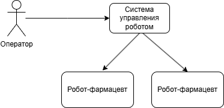

# Робот-фармацевт

## Краткое описание проектируемой системы

Продукт - робот-фармацевт, который производит лекарство по индивидуальному рецепту.
Рецепт включает в себя:
a) точный состав и количество компонентов, порядок и условия изготовления конечного продукта;
б) уникальный идентификатор лекарства, который изготавливается в определённом объёме для индивидуального
курса лечениявалифицированным персоналом без необходимости изменения системного ПО.

## Ключевые ценности, ущербы, неприемлемые события

| Ценность | Нежелательные события | Величина ущерба | Комментарий |
|----------|-----------------------|-|------------|
| Лекарство | Нарушение технологичского процесса | Высокий | Возможно причинение вреда здоровью клиента  | 
| Рецептура | Неавторизованный доступ к рецептуре (раскрытие торгового секрета) | Выскокий | Конкуренты смогут производить аналоги. PR риски из-за публикации рецептуры (критично для дорогостоящего БАДов и прочей геопатии) |
| Персональные данные | Неавторизованный доступ к персональным данных клиентов | Высокий | Оборотный штраф для организации| 
Робот | Невозможность производства лекарства из-за отказа оборудования | Средний | При необходимости сотруник фармацевт сможет вручную приготовить небольшие партии лекарства| 
| Люди | Отправление из-за приёма неправильного лекарства | Высокий | Возможно причинение вреда здоровью клиента |

## Роли пользователей

| Роль | Назначение |
|----------|-----------------------|
| Оператор-фармацевт | Вводит задание на производство и получает лекарство дл передачи клиенту | 
| Пациент | Получает рецепт от врача в клинике и по этому рецепту получает лекарство в аптеке |

## Контекст

## Цели и предположения безопасности

#### Цели безопасности
Непрерывная работа инфрастуктуры.

#### Предположения безопасности
Обеспечить физическую безопасность оборудования. Провести аудит безопасности прикладного приложения.

## Негативные сценарии

Рассмотрим сценарий, когда место оператора АРМ было захвачено и отправляется нелегитимная команда

