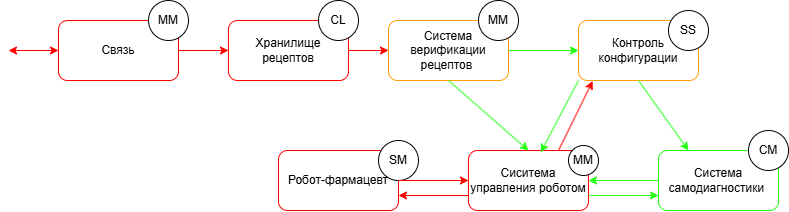

# Робот-фармацевт

## Краткое описание проектируемой системы

Продукт - робот-фармацевт, который производит лекарство по индивидуальному рецепту.
Рецепт включает в себя:
a) точный состав и количество компонентов, порядок и условия изготовления конечного продукта;
б) уникальный идентификатор лекарства, который изготавливается в определённом объёме для индивидуального
курса лечениявалифицированным персоналом без необходимости изменения системного ПО.

## Ключевые ценности, ущербы, неприемлемые события

| Ценность | Нежелательные события | Величина ущерба | Комментарий |
|----------|-----------------------|-|------------|
| Лекарство | Нарушение технологичского процесса | Высокий | Возможно причинение вреда здоровью клиента  | 
| Рецептура | Неавторизованный доступ к рецептуре (раскрытие торгового секрета) | Выскокий | Конкуренты смогут производить аналоги. PR риски из-за публикации рецептуры (критично для дорогостоящего БАДов и прочей геопатии) |
| Персональные данные | Неавторизованный доступ к персональным данных клиентов | Высокий | Оборотный штраф для организации| 
Робот | Невозможность производства лекарства из-за отказа оборудования | Средний | При необходимости сотруник фармацевт сможет вручную приготовить небольшие партии лекарства| 
| Люди | Отправление из-за приёма неправильного лекарства | Высокий | Возможно причинение вреда здоровью клиента |

## Роли пользователей

| Роль | Назначение |
|----------|-----------------------|
| Оператор-фармацевт | Вводит задание на производство и получает лекарство дл передачи клиенту | 
| Пациент | Получает рецепт от врача в клинике и по этому рецепту получает лекарство в аптеке |

## Контекст

## Основные функциональные сценарии

## Высокоуровневая архитектура

## Описание подсистем
| Название | Назначение |
|----------|-----------------------|
| Связь  | 	Обеспечивает передачу данных между подсистемами.| 
| Система управления роботом| Контролирует процесс производства: отправляет команды роботу, получает и анализирует его состояние, обеспечивает выполнение технологической последовательности.|
| Робот-фармацевт  | 	Выполняет операции по смешиванию, дозировке и упаковке лекарственных средств.| 
| Система верификации рецептов| 	Проверяет подлинность и корректность полученного рецепта, включая состав, дозировку и уникальные идентификаторы, а также подтверждает, что рецепт выдан авторизованным источником и соответствует установленным медицинским стандартам и регламентам.
|

## Расширенные диаграммы функциональных сценариев

## Цели и предположения безопасности

#### Цели безопасности
1. Состав лекарства, приготовленного роботом, совпадает с рецептурными параметрами, заданными авторизованным оператором..

2. Доступ к рецептурной информации и персональным данным клиентов возможен только для авторизованных ролей через доверенные каналы и средства.

3. Функциональное состояние роботизированного комплекса подтверждается встроенной системой самодиагностики, и управление недоступно при выявленных критических неисправностях.

4. Перед выдачей клиенту лекарственного средства, система подтверждает соответствие состава, срока годности и условий хранения, и блокирует выдачу при нарушении любого из критериев.

####  Предположения безопасности
1. Физическая защита: Потенциальный злоумышленник не имеет физического доступа к роботу-фармацевту, его сенсорам, исполнительным устройствам и коммуникационным портам.

2. Контроль доступа: Только аутентифицированные и авторизованные пользователи имеют доступ к интерфейсу управления роботом и к его программной конфигурации.

3. Благонадежность пользователей: Авторизованные пользователи не действуют злонамеренно и не стремятся преднамеренно нарушить работоспособность системы или компрометировать данные.

4. Изолированность среды исполнения: Программное обеспечение робота исполняется в среде, защищённой от внедрения стороннего кода извне, при условии соблюдения организационных мер защиты.

5. Сетевая безопасность обеспечена извне: Защита от сетевых атак (например, MitM или DoS) на внешние каналы связи обеспечивается средствами внешней инфраструктуры (например, фильтрацией трафика на уровне шлюзов).

## Таблица соотнесения ценностей, неприемлемых событий и целей безопасности
| Ценность | Негативное событие | Оценка ущерба | Цель безопасности |
|----------|-----------------------|-|--------|
| Лекарство | Нарушение технологичского процесса | Высокий | 1 | 
| Рецептура | Неавторизованный доступ к рецептуре (раскрытие торгового секрета) | Выскокий |2|
| Персональные данные | Неавторизованный доступ к персональным данных клиентов | Высокий |2| 
Робот | Невозможность производства лекарства из-за отказа оборудования | Средний | 3| 
| Люди | Отправление из-за приёма неправильного лекарства | Высокий | 4 |

## Негативные сценарии

 ## Политика архитектуры 
 #### Базовая версия 
 
 | Домен безопасности | Уровень доверия | Оценка сложности и размера домена | Обоснование |
|----------|-----------------------|-|--------|
| Связь | Недоверенный| MM| При компрометации нарушение целостности данных блокируется проверкой в системе управления производством.| 
| Система управления роботом| Доверенный, повышающий целостность данных | MM|Отвечает за точность исполнения рецепта и технологическую последовательность. При компрометации возникает риск некорректного производства.|
| Робот-фармацевт | Доверенный | SM |При компрометации возможно нарушение технологического процесса.| 
Система верификации рецептов| Недоверенный | MM | Анализирует полученный рецепт на подлинность. Ошибки или атаки могут привести к принятию недействительного или изменённого рецепта.| 

 #### Логическая архитектура
 
 | Домен безопасности | Уровень доверия | Оценка сложности и размера домена | Обоснование |
|----------|-----------------------|-|--------|
| Связь | Недоверенный| MM| При компрометации нарушение целостности данных блокируется проверкой в системе контроля конфигураций.|
| Хранилище рецептов | Недоверенный| CL| При компрометации возможна подмена рецептов, что повлияет на достоверность производственного процесса. Проверка идёт на уровне верификации.| 
| Система управления роботом| Недоверенный| MM |	Управляет всей роботизированной логикой. При компрометации возможна подмена команд, но система конфигурации минимизирует риски.|
| Робот-фармацевт | Недоверенный | SM |При компрометации возможно нарушение технологического процесса.| 
Система верификации рецептов| Доверенный, повышающий целостность данных | MM |Может быть подменён или принят недостоверный рецепт, влияя на достоверность исходных данных.| 
Контроль конфигурации| Доверенный, повышающий целостность данных| SS |Критическая подсистема, гарантирующая соответствие производственного процесса утверждённым параметрам. При её компрометации нарушается вся модель доверия.|
Система самодиагностики| Доверенный| CM |	Проверяет внутреннюю целостность компонентов. При компрометации может дать ложные данные о состоянии системы.|

 #### Реальная архитектура 
 
 | Домен безопасности | Уровень доверия | Оценка сложности и размера домена | Обоснование |
|----------|-----------------------|-|--------|
| Связь | Недоверенный| MM| Находится вне доверенной зоны. Возможна подмена или искажение данных извне. Угрозы смягчаются системой верификации и контролем конфигурации.|
| Хранилище рецептов | Недоверенный| CL|Уязвим для атак, так как получает данные извне. Может содержать поддельные или искажённые рецепты. Надёжность обеспечивается дальнейшей проверкой.| 
| Система управления роботом| Недоверенный |MM |	Подвержена атаке через команды от брокера. Проверяется системой конфигурации. При сбое может нарушить работу производственного процесса.|
| Робот-фармацевт | Недоверенный | SM |	Выполняет производство. Уязвим к недостоверным управляющим командам. Компрометация влияет на физический результат.| 
| Система верификации рецептов| Доверенный, повышающий целостность данных | MM |Работает в доверенной зоне. Проверяет рецепты на корректность и подлинность, фильтрует недостоверные данные.| 
Контроль конфигурации| Доверенный, повышающий целостность данных| SS |Критическая подсистема, гарантирующая соответствие производственного процесса утверждённым параметрам. При её компрометации нарушается вся модель доверия.|
Брокер сообщений| Доверенный, повышающий целостность данных| MM |Центр маршрутизации сообщений, получает данные как от доверенных, так и недоверенных компонентов. Риски снижены за счёт мониторинга и верификации.|
Монитор безопасности| Доверенный| SM |Отвечает за контроль работы подсистем, регистрирует нарушения. Вмешательство в него может скрыть атаки.|
Система самодиагностики| Доверенный| CM |	Обеспечивает контроль технического состояния. Подмена информации в ней может привести к эксплуатации неисправных узлов|

#### Политика безопасности взаимодействий
    import base64

    VERIFIER_SEAL = 'verifier_seal' # строка-подпись, используется как простой маркер целостности и доверия

    def check_payload_seal(payload): # функция убедиться, что данные не были изменены и были подписаны надёжным источником
        try:
            p = base64.b64decode(payload).decode()
            if p.endswith(VERIFIER_SEAL):
                print('[info] payload seal is valid')
                return True
        except Exception as e:
            print(f'[error] seal check error: {e}')
        return False

    def check_operation(id, details):
        authorized = False
        print(f"[info] checking policies for event {id}, {details['source']}->{details['deliver_to']}: {details['operation']}")

        src = details['source']
        dst = details['deliver_to']
        operation = details['operation']

        # Связь -> Брокер (начало запроса)
        if src == 'connection' and dst == 'broker' and operation == 'request_recipe':
            authorized = True

        # Брокер -> Хранилище рецептов 
        if src == 'broker' and dst == 'recipe_storage' and operation == 'get_recipe':
            authorized = True

        # Хранилище рецептов -> Брокер 
        if src == 'recipe_storage' and dst == 'broker' and operation == 'recipe_found':
            authorized = True

        # Брокер -> Система верификации рецептов 
        if src == 'broker' and dst == 'recipe_verifier' and operation == 'verify_recipe':
            authorized = True

        # Система верификации рецептов <-> Хранилище рецептов 
        if src == 'recipe_verifier' and dst == 'recipe_storage' and operation == 'get_recipe_data':
            authorized = True
        if src == 'recipe_storage' and dst == 'recipe_verifier' and operation == 'recipe_data':
            authorized = True

        # Система верификации -> Контроль конфигурации 
        if src == 'recipe_verifier' and dst == 'config_control' and operation == 'recipe_verified':
            authorized = True

        # Брокер -> Контроль конфигурации 
        if src == 'broker' and dst == 'config_control' and operation == 'control_request':
            authorized = True

        # Контроль конфигурации <-> Система управления роботом 
        if src == 'config_control' and dst == 'robot_control' and operation == 'apply_recipe':
            authorized = True
        if src == 'robot_control' and dst == 'config_control' and operation == 'report_state':
            authorized = True

        # Система управления роботом -> Брокер 
        if src == 'robot_control' and dst == 'broker' and operation == 'status_report':
            authorized = True

        #  Система управления роботом -> Система самодиагностики 
        if src == 'robot_control' and dst == 'self_diagnosis' and operation == 'request_diagnostics':
            authorized = True

        #  Система самодиагностики -> Брокер 
        if src == 'self_diagnosis' and dst == 'broker' and operation == 'diagnostic_result':
            authorized = True

        # Брокер -> Монитор безопасности 
        if src == 'broker' and dst == 'security_monitor' and operation == 'log_event':
            authorized = True

        #  Монитор безопасности -> Брокер 
        if src == 'security_monitor' and dst == 'broker' and operation == 'alert':
            authorized = True

        # Верифицированная передача рецепта в управление роботом 
        if src == 'broker' and dst == 'robot_control' and operation == 'apply_verified_recipe':
            if details.get('verified') and check_payload_seal(details.get('blob', '')):
                authorized = True

        # Робот-фармацевт -> Брокер
        if src == 'pharma_robot' and dst == 'broker' and operation == 'ready_product':
            authorized = True

        # Брокер -> Связь (выдача готового лекарства пользователю)
        if src == 'broker' and dst == 'connection' and operation == 'deliver_product':
            if details.get('verified') and check_payload_seal(details.get('product_blob', '')):
                authorized = True

        return authorized
